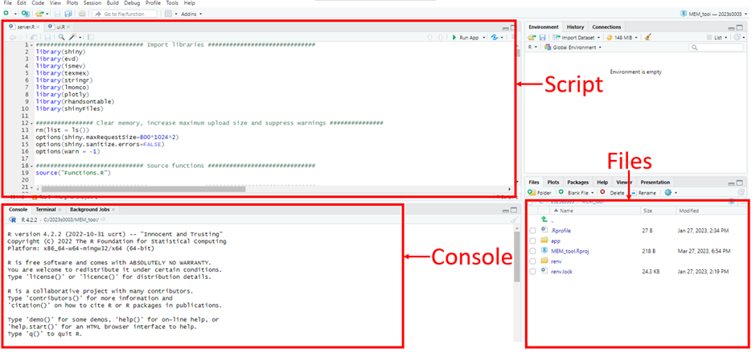
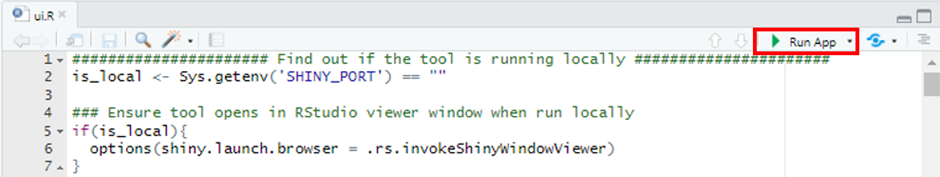
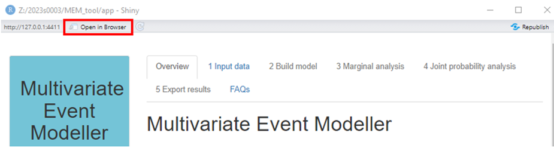

# Installation instructions

There are two options for installation: RStudio or Docker. Assumptions and requirements are
explained in the introduction to each method.

## Installation using RStudio

### Install R, RStudio and Rtools

The Multivariate Event Modeller (MEM) tool is an R ‘Shiny app’ developed in R using Windows 10. It has been set up in a
reproducible environment using R v4.2.2. The reproducible environment is most likely to work
correctly if used within this version of R (or at least in v4.2). The MEM tool has been tested on
Windows using R v4.2.2 and RStudio version 2022.12.0.

You will need to install R and then RStudio to run the MEM tool from within RStudio. To install R:

- For Windows, go to <https://cran.r-project.org/bin/windows/base/old/4.2.2/> and download
  “R-4.2.2-win.exe”. Open the downloaded file and follow the instructions on the installer.
- For Linux, go to <https://cran.rstudio.com/bin/linux/> and follow the instructions for your
  version of Linux.
- For Mac, download and install “R-4.2.2.pkg” from <https://cran.r-project.org/bin/macosx/base/>.

RStudio can then be installed from <https://posit.co/download/rstudio-desktop/>. For Windows, you
can press the “Download RStudio Desktop for Windows” button and open the .exe file. Otherwise,
scroll down and download the correct file for your operating system.

On Windows, Rtools will also be required to build some of the packages. Go to
<https://cran.r-project.org/bin/windows/Rtools/rtools42/rtools.html> and download the Rtools42
installer (this is the appropriate version for use with R v4.2). Open the downloaded file and follow
the instructions in the prompt. If you are using Linux or Mac, you do not need to install Rtools.

### Installing the MEM

The MEM repository and zip file contain the following:

- An ‘app’ folder. This includes the elements of the MEM tool:
  - Three R scripts (‘server.R’, ‘ui.R’ and ‘Functions.R’).
  - A ‘data’ folder containing example data used in the user guide case studies. This data has been
    processed and provided for the purposes of testing the case studies only and should not be used
    elsewhere.
- A ‘renv’ folder. This includes the files associated with setting up the reproducible environment.
- A ‘renv.lock’ file. This is also associated with setting up the reproducible environment.
- ‘MEM_tool.RProj’. This is an R project that pulls together all of the above.

Extract the files associated with the tool from the zip file. They will need to be in an unzipped
folder located somewhere on your computer.

### Opening in RStudio

You will need to run the tool from within RStudio. Open a new RStudio window, and from within there,
open the ‘MEM_tool’ R project: “File -\> Open project”. You can see all the files relating to the
MEM in the ‘Files’ tab in the bottom right quadrant.

### Loading the reproducible environment

To run the MEM, you will need to install the R package “renv”. The version of “renv” used in
development was 0.16.0. In the console (the bottom left quadrant of RStudio if a script is open or 
the entire left side if not) run:

``` r
install.packages("renv")
```

To run a command in RStudio, type (or copy and paste) the command in the console and press enter.

Keep the default settings. This step is only required the first time you install the tool because
the package will then be saved in your R library.

To use the package, you will need to load it from your library by running the following in the
console:

``` r
library(renv)
```

You will need to be in the same working directory as the lock file, titled “renv.lock”, which should
be stored in the repository with the rest of the code. The lock file contains details of all the R
packages used by the MEM tool. You should automatically be in the correct folder if you have opened
the ‘MEM_tool’ project.

Recreate the reproducible environment in which the MEM was created by restoring renv. In the
console, run:

``` r
renv::restore()
```

This will install the correct versions of the R packages that underpin the MEM tool. It may ask you
some questions on first-time use, but you can agree to the default settings. First time set-up may
take a while if there are lots of packages to install. You should restore renv every time you use
the app.

### Running the App

Once you have loaded renv, to run the tool, you must open the ui.R file. Do this by clicking the app
folder, and then ui.R. This will open in the top left quadrant of RStudio.



Press the “Run App” button located in the top right corner of the script you opened:



If you can’t see the “Run App” button then make sure you have the ui.R file open in RStudio. This
will open the MEM in a new R window.

It may be faster to run the MEM in your browser than from the RStudio console; this can be achieved
by clicking the “Open in Browser” button in the top left corner of the new window that opened.



## Installation using Docker

### Set up

This guide assumes you are working in Windows 10 and have [installed
Docker](https://docs.docker.com/get-docker/). The **unzipped** project directory should be located
on your machine. This method may be more suitable for users who are confident using the command
prompt and Docker. Note that you may need to pay for a Docker subscription.

The Dockerfile contains commands to build an image of the MEM tool and the environment in which it
was created so that you can run the MEM without installing R and RStudio onto your desktop.

### Build the image

To build the image from the Dockerfile, open the command prompt (search for “cmd” on your computer)
and move to the root directory of the tool.

```
cd path\to\mem\tool
```

You should be in the directory containing the Dockerfile.

Run the following command. This will take a couple of minutes.

```
docker build --tag mem-tool .
```

Note that the “.” at the end is an important part of the command.

### Start the container

Run the following command.

```
docker run --publish 3838:3838 mem-tool
```

In a browser, visit <http://localhost:3838/> to access the app.
